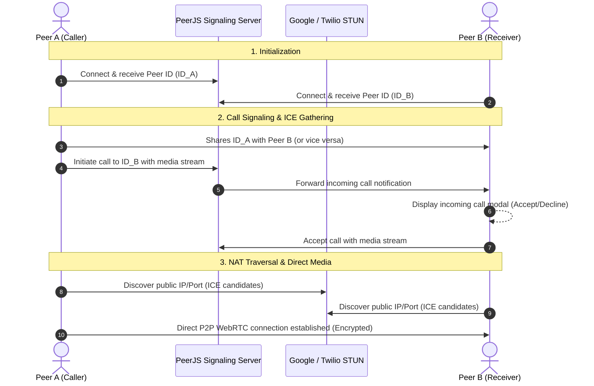

# 🎥 NexusCall — WebRTC P2P Video & Audio Calling

<p align="center">
  
</p>

<p align="center">
  <strong>Lightweight, real-time, browser-to-browser video & audio communication powered by WebRTC and PeerJS.</strong>
</p>

<p align="center">
  
  
  
  
  
</p>

---

## 📖 Overview

**NexusCall** is a zero-configuration, peer-to-peer (P2P) video and voice calling web application. It allows two users to connect directly from their browsers in real time simply by sharing a unique **Peer ID**. 

### 🌟 Why NexusCall?
- **No Database or Sign-up Required:** Connect immediately without registering accounts or managing databases.
- **Zero Build Step:** Uses pure modern JavaScript (ES6+), Tailwind CSS CDN, and PeerJS. No `npm install`, Webpack, or Vite build steps required.
- **Direct P2P Media Streaming:** Audio and video streams flow directly between peers via WebRTC, ensuring minimal latency and high privacy.
- **Resilient Fallback Engine:** Built-in synthetic media generator prevents call handshake crashes even if physical camera or microphone access is restricted.

---

## ✨ Features

- 📞 **Direct P2P Video & Audio Calls:** Low-latency, high-quality audio and video streaming directly between peers.
- 🔔 **Interactive Call Alerts:** Incoming call modal dialog with instant **Accept** and **Decline** options.
- 🎙️ **Live Media Controls:** Toggle camera (video on/off) and microphone (mute/unmute) anytime during an ongoing call.
- 🖥️ **Screen Sharing:** Seamlessly switch between camera feed and desktop/window screen sharing using `navigator.mediaDevices.getDisplayMedia` and WebRTC track replacement (`replaceTrack`).
- 📋 **One-Click Peer ID Sharing:** Quick-copy button to easily copy and send your unique Peer ID.
- 🔄 **Synthetic Canvas Fallback Stream:** If camera permissions are denied or unavailable, the app automatically generates an animated canvas video stream paired with a synthetic silent audio track so WebRTC negotiation can still succeed without crashing.
- 🛡️ **HTTP / Insecure Context Helper:** Automatically detects if the application is accessed over non-localhost HTTP (e.g., LAN IP `http://192.168.x.x`), warning the user and providing a guided modal with a one-click copy button for Chrome's insecure origin flag.
- 🔊 **Browser Autoplay Protection:** Detects and handles browser autoplay restrictions with a one-click overlay to enable remote sound and video.
- 🌐 **Global STUN Servers:** Integrated with Google and Twilio public STUN servers for reliable NAT traversal and ICE candidate negotiation.
- 🎨 **Modern Dark UI:** Responsive and sleek dark-mode user interface crafted with Tailwind CSS and Font Awesome icons.

---

## 🛠️ Tech Stack

| Layer | Technology | Description |
| :--- | :--- | :--- |
| **Frontend** | HTML5, CSS3, JavaScript (ES6+) | Core user interface and client-side media logic |
| **Styling** | [Tailwind CSS](https://tailwindcss.com/) (CDN) | Responsive utility-first dark styling |
| **Icons** | [Font Awesome 6](https://fontawesome.com/) (CDN) | Modern icons for media and call controls |
| **P2P / WebRTC** | [PeerJS v1.5.2](https://peerjs.com/) | WebRTC wrapper for peer connection management and signaling |
| **Backend** | PHP (Apache / XAMPP) | Local web hosting and optional session verification endpoint |
| **ICE / STUN** | Google & Twilio STUN | Public STUN infrastructure for NAT traversal |

---

## 📐 Architecture & Connection Flow



---

## 📁 Project Structure

```plaintext
videocall/
├── index.php                         # Main application (UI, WebRTC logic & PeerJS integration)
├── auth.php                          # JSON API endpoint reporting session status and server timestamp
├── Progressive_Web_Apps_Logo.svg.webp# Graphical asset / logo
├── LICENSE                           # MIT License
└── README.md                         # Project documentation
```

### Key Files:
- **`index.php`**: Contains the complete frontend interface, media initialization (`getUserMedia`), fallback canvas generator (`createFallbackStream`), PeerJS connection event handlers, screen sharing toggles, and toast notifications.
- **`auth.php`**: A lightweight PHP API endpoint that returns session status and server time (`application/json`), useful for extending authentication or heartbeat checks.

---

## 📋 Prerequisites & System Requirements

1. **Web Server:** 
   - [XAMPP](https://www.apachefriends.org/) (Apache + PHP 7.4+ or 8.x) OR
   - PHP Built-in Server (`php -S`) OR
   - Any Apache / Nginx server with PHP support.
2. **Web Browser:** Modern WebRTC-compliant browser:
   - Google Chrome / Chromium
   - Microsoft Edge
   - Mozilla Firefox
   - Brave / Opera / Safari
3. **Hardware:** Functional camera and microphone (though synthetic fallback stream is provided if devices are absent).
4. **Internet Access:** Required for CDN resources (Tailwind CSS, Font Awesome, and PeerJS signaling).

---

## 🚀 Quick Start Guide

### Option 1: Using XAMPP (Recommended)

1. **Move Project to XAMPP Web Root:**
   Copy the `videocall` folder to your XAMPP `htdocs` directory:
   ```text
   C:\xampp\htdocs\videocall
   ```

2. **Start Apache:**
   - Open the **XAMPP Control Panel**.
   - Click **Start** next to the **Apache** module.

3. **Open in Browser:**
   Navigate to:
   ```text
   http://localhost/videocall/
   ```

---

### Option 2: Using PHP Built-in Server

If you have PHP installed directly in your terminal/command line:

1. Open PowerShell or Command Prompt in the project folder:
   ```powershell
   cd d:\xampp\htdocs\videocall
   ```

2. Run the built-in development server:
   ```powershell
   php -S localhost:8000
   ```

3. Open your browser at:
   ```text
   http://localhost:8000
   ```

---

## 🎮 How to Use

### 1. Initial Permission
- Open `http://localhost/videocall/` in your browser.
- Allow camera and microphone access when prompted.
- Your unique ID will appear under **My ID** in the bottom-left toolbar.

### 2. Testing Locally (Two Browser Windows)
1. Open one window in normal mode: `http://localhost/videocall/`.
2. Open a second window in **Incognito / Private** mode (or in another browser like Edge): `http://localhost/videocall/`.
3. In Window 1, click **Copy** next to **My ID**.
4. In Window 2, paste the ID into the **Paste Remote Peer ID here...** field.
5. Click **Call**.
6. In Window 1, an **Incoming Call** popup will appear. Click **Accept**.
7. Both video feeds will connect live!

### 3. In-Call Controls
| Icon | Button | Description |
| :---: | :--- | :--- |
| <i class="fa-solid fa-microphone"></i> | **Microphone** | Mute or unmute your microphone audio. |
| <i class="fa-solid fa-video"></i> | **Camera** | Enable or disable your local camera feed. |
| <i class="fa-solid fa-desktop"></i> | **Screen Share** | Share your entire screen, application window, or browser tab. |
| <i class="fa-solid fa-phone-slash"></i> | **End Call** | Disconnect the active call and reset stream views. |

---

## 🔒 Network Setup: Local Network (LAN) & HTTPS

Modern web browsers enforce **Secure Contexts (HTTPS)** for sensitive APIs such as `navigator.mediaDevices.getUserMedia`.

> [!WARNING]
> If you access the application from another device on your local Wi-Fi/LAN using an IP address (e.g., `http://192.168.1.15/videocall/`), Chrome and Edge will **block camera and microphone access** by default.

### Recommended Solutions:

#### Method A: Chrome / Edge Insecure Origin Flag (Quickest for Testing)
1. Open a new tab in Chrome or Edge.
2. Paste this URL into your address bar:
   ```text
   chrome://flags/#unsafely-treat-insecure-origin-as-secure
   ```
3. In the text area, enter your server's IP and port (e.g., `http://192.168.1.15` or `http://192.168.1.15:80`).
4. Set the dropdown to **Enabled**.
5. Click **Relaunch** at the bottom right.
6. Open your LAN URL again — camera permissions will now work!

#### Method B: Tunneling via Ngrok or Localtunnel (HTTPS)
Expose your local server securely with HTTPS for testing across devices or the internet:
```bash
# Using Ngrok
ngrok http 80

# Using Localtunnel
npx localtunnel --port 80
```
Use the provided `https://...` URL on any mobile device or remote laptop.

#### Method C: Enable SSL on XAMPP Apache
Generate a self-signed local certificate and enable SSL (`https://localhost/videocall/`) in Apache `httpd-ssl.conf`.

---

## 🧩 API Reference (`auth.php`)

The project includes an optional authentication and session status endpoint:

- **URL:** `/auth.php`
- **Method:** `GET`
- **Response Type:** `application/json`

### Example Response:
```json
{
  "status": "success",
  "authenticated": false,
  "server_time": 1725782400
}
```

---

## ❓ Troubleshooting

| Issue | Cause | Solution |
| :--- | :--- | :--- |
| **"Connecting to signaling server..." stuck** | Internet or CDN blocked | Ensure you have an active internet connection to reach PeerJS signaling servers and CDN scripts. |
| **"Camera Blocked by Browser (HTTP IP Connection)"** | Insecure context over LAN IP | Use `localhost` or follow the [LAN & HTTPS Guide](#-network-setup-local-network-lan--https) above. |
| **Remote video is black or audio is muted** | Browser autoplay policy | Click the on-screen button **"Click to Unmute / Play Video"** to allow media playback. |
| **"Remote Peer ID not found or offline"** | Incorrect Peer ID entered | Verify that the remote peer is online and copy the exact Peer ID without leading/trailing spaces. |
| **Screen sharing stops unexpectedly** | User clicked "Stop sharing" | You can click the screen share button again at any time to re-share. |

---

## 📜 License

This project is licensed under the **MIT License**. See the [LICENSE](LICENSE) file for more information.

---

<p align="center">
  Developed with ❤️ using <strong>WebRTC</strong> & <strong>PeerJS</strong>.
</p>