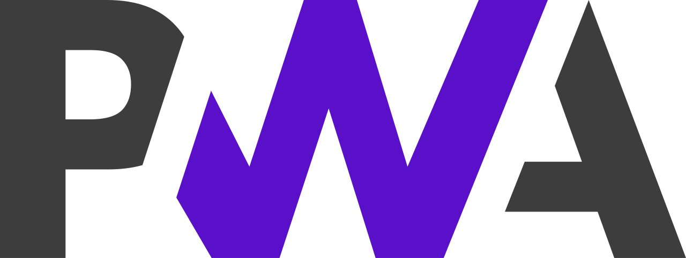
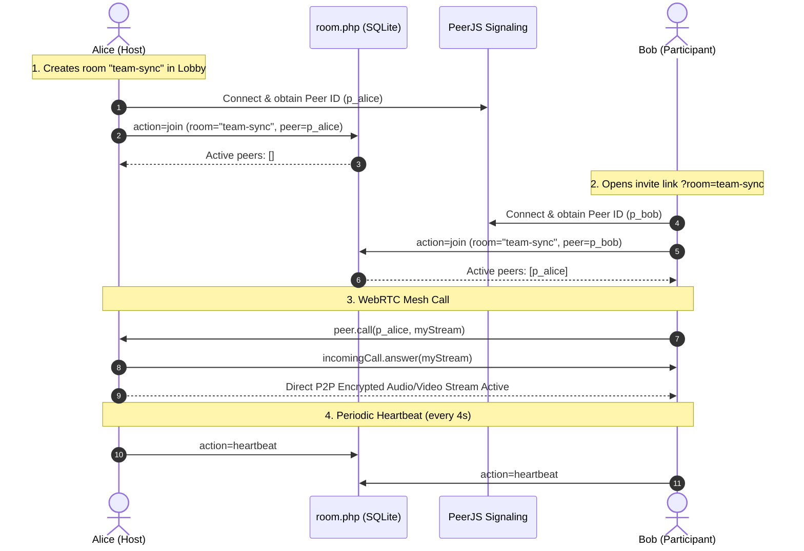

# 🎥 NexusCall — Multi-User WebRTC Video Conferences & Meetings

<p align="center">
  
</p>

<p align="center">
  <strong>Modern, lightweight, multi-party video conferencing web application built with WebRTC, PeerJS, Tailwind CSS, and PHP.</strong>
</p>

<p align="center">
  
  
  
  
  
</p>

---

## 📖 Overview

**NexusCall** is a Google Meet / Zoom style multi-user video conferencing platform designed for simplicity, speed, and privacy. Users can create meeting rooms, share one-click invite links, and communicate in real time with encrypted peer-to-peer audio, video, and screen sharing.

### 🌟 Key Highlights
- **Multi-User Rooms:** Supports group meetings where multiple participants can connect simultaneously into an adaptive, auto-scaling video grid.
- **Shareable Invite Links:** No more complicated IDs to copy manually. Simply share your meeting URL (`http://localhost/videocall/?room=team-sync`) and participants join instantly.
- **Pre-Join Room Lobby:** Test your camera, mute your microphone, and set your display name before entering the live meeting.
- **Zero Configuration / Standalone:** Powered by native PHP and SQLite with no Node.js/npm dependencies, no external database setup, and zero build steps.
- **Privacy First (P2P):** Media streams flow directly between browsers using WebRTC encryption.

---

## ✨ Features

- 👥 **Multi-Party Video Conferencing:** Full-mesh WebRTC architecture enabling group calls with real-time video and audio.
- 🔗 **One-Click Shareable Invite Links:** Generate clean meeting links. Includes mobile native Web Share API support and fast clipboard copy.
- 🏢 **Interactive Pre-Join Lobby:** Preview your camera and mic, check audio activity indicators, and customize your name before joining.
- 🖥️ **Group Screen Sharing:** Broadcast your desktop, window, or browser tab to all room participants simultaneously with smooth video track switching (`replaceTrack`).
- 🎙️ **Live Media Controls:** Ergonomic floating dock to mute/unmute microphone, enable/disable camera, or view the meeting participants drawer.
- 📱 **Adaptive Multi-Video Grid:** Automatically adjusts layout (1, 2, 4, 6, 8+ participants) with participant name tags and mute status badges.
- 🔄 **Synthetic Canvas Fallback Stream:** Automatically generates an animated avatar canvas video stream with silent audio if camera permissions are blocked or unavailable, preventing call handshake failures.
- 🛡️ **LAN / HTTP Security Assistant:** Built-in modal helper for local network testing on Chrome/Edge (`chrome://flags/#unsafely-treat-insecure-origin-as-secure`).
- 🔊 **Browser Autoplay Protection:** Auto-detects audio autoplay restrictions and displays an instant "Click to Unmute" button.
- ⚡ **Auto-Pruning SQLite Registry:** Automatically cleans up participants who disconnect or close their browser tab after 15 seconds.

---

## 🛠️ Tech Stack

| Layer | Technology | Description |
| :--- | :--- | :--- |
| **Frontend UI** | HTML5, CSS3, Modern ES6+ JavaScript | Single-page application logic and dynamic grid layout |
| **Styling** | [Tailwind CSS](https://tailwindcss.com/) (CDN) | Modern dark obsidian theme with electric indigo accents |
| **Icons** | [Font Awesome 6](https://fontawesome.com/) (CDN) | Vector icons for conference controls and indicators |
| **P2P / WebRTC** | [PeerJS v1.5.2](https://peerjs.com/) | Peer-to-peer data and media stream connection manager |
| **Room Backend** | PHP 7.4+ / 8.x + SQLite (PDO) | Zero-config participant coordination and heartbeat engine (`room.php`) |
| **ICE / STUN** | Google & Twilio STUN | Public STUN infrastructure for NAT traversal |

---

## 📐 Connection Architecture & Multi-User Flow



---

## 📁 Project Structure

```plaintext
videocall/
├── index.php                         # Complete UI: Lobby, Meeting Room, Controls & WebRTC logic
├── room.php                          # Backend REST API for room participant signaling and heartbeats
├── auth.php                          # JSON API endpoint reporting session status and server timestamp
├── data/                             # Auto-created directory for SQLite database (gitignored)
│   └── rooms.sqlite                  # SQLite database tracking active room participants
├── Progressive_Web_Apps_Logo.svg.webp# Application logo
├── LICENSE                           # MIT License
└── README.md                         # Documentation
```

---

## 🚀 Quick Start Guide (XAMPP)

1. **Place Project in XAMPP `htdocs`:**
   ```text
   C:\xampp\htdocs\videocall
   ```

2. **Start Apache:**
   - Open **XAMPP Control Panel**.
   - Click **Start** next to **Apache** (MySQL is optional; `room.php` uses built-in SQLite).

3. **Launch in Browser:**
   Open:
   ```text
   http://localhost/videocall/
   ```

---

## 🎮 How to Use

### Step 1: Pre-Join Lobby
- Enter your **Display Name** (e.g. `Nouman`).
- Choose **Create Instant New Room** (or enter a custom Room ID).
- Test and toggle your camera and microphone in the preview box.
- Click **Join Meeting Room**.

### Step 2: Inviting Other Participants
- Inside the meeting, click the **Copy Link** button in the top bar or floating dock.
- Send the copied URL to any participant:
  ```text
  http://localhost/videocall/?room=your-room-id
  ```
- When they open the link, the Room ID will automatically pre-fill in their lobby.
- Once they click **Join**, they will automatically appear in the video grid!

### Step 3: Meeting Controls & Keyboard Shortcuts
| Action | Button | Keyboard Shortcut |
| :--- | :---: | :---: |
| **Mute / Unmute Mic** | <i class="fa-solid fa-microphone"></i> | <kbd>M</kbd> |
| **Camera On / Off** | <i class="fa-solid fa-video"></i> | <kbd>V</kbd> |
| **Share Screen** | <i class="fa-solid fa-desktop"></i> | <kbd>S</kbd> |
| **Share / Copy Link** | <i class="fa-solid fa-share-nodes"></i> | — |
| **View Participants** | <i class="fa-solid fa-user-group"></i> | — |
| **Leave Meeting** | <i class="fa-solid fa-phone-slash"></i> | — |

---

## 🔒 Local Network (LAN) & HTTPS Notes

Browsers restrict `getUserMedia` (camera and microphone) to **Secure Contexts (HTTPS)** or `localhost`. If testing across devices on your local Wi-Fi IP (e.g., `http://192.168.1.15/videocall/`):

### Quick Chrome/Edge Fix for LAN Testing:
1. In Chrome / Edge address bar, open:
   ```text
   chrome://flags/#unsafely-treat-insecure-origin-as-secure
   ```
2. Enter your LAN IP and port: `http://192.168.1.15` (or your PC's IP).
3. Select **Enabled** and click **Relaunch**.
4. Reload the page and camera access will work seamlessly!

---

## 📜 License

This project is licensed under the **MIT License**. See the [LICENSE](LICENSE) file for details.